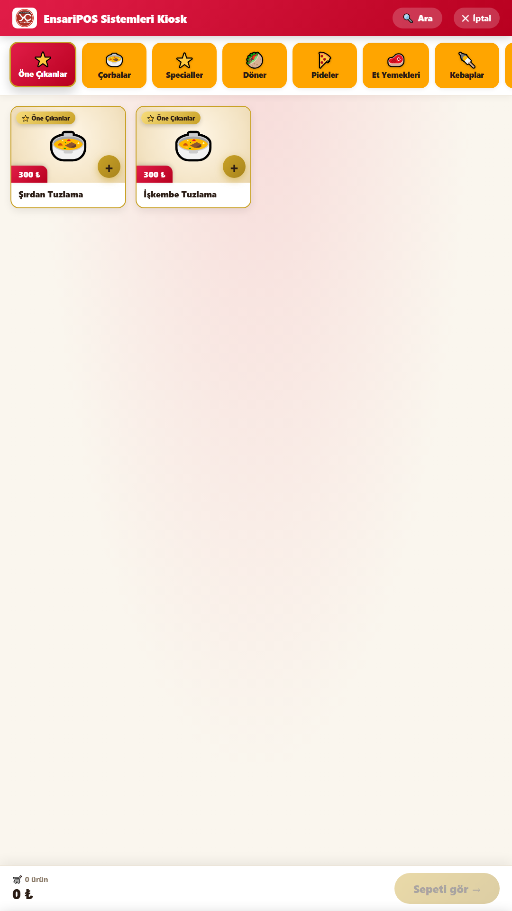
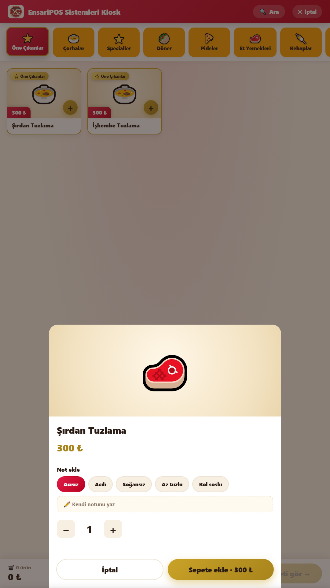
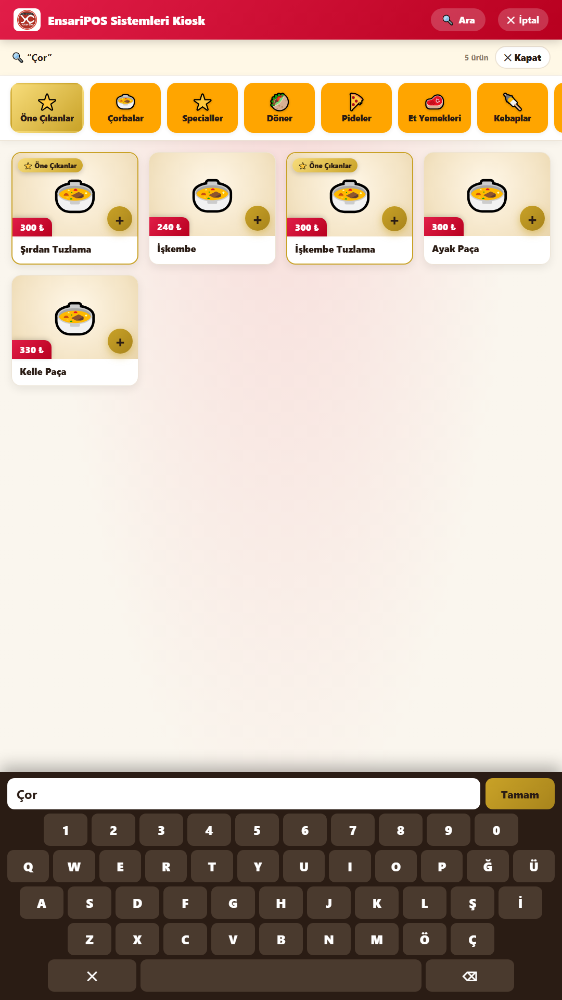
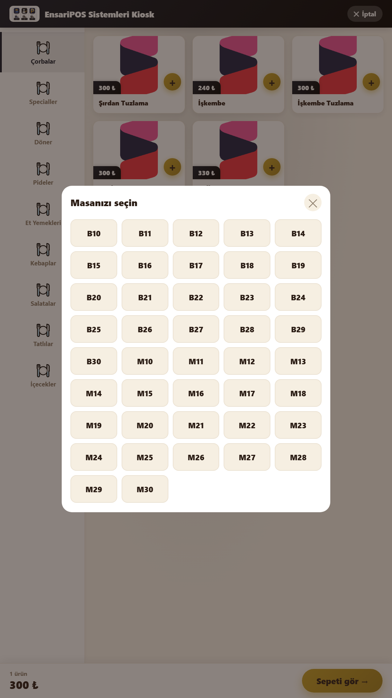
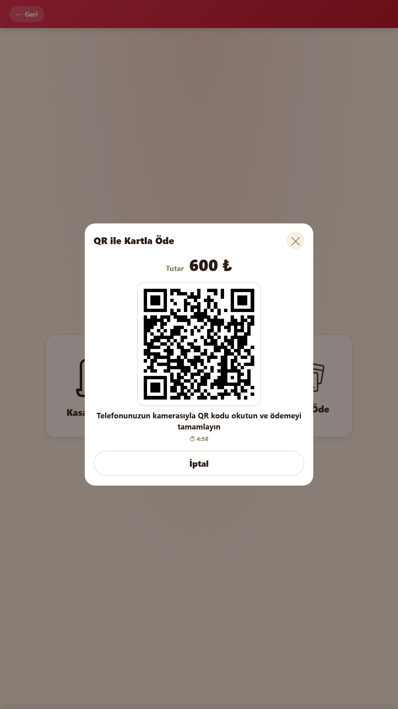
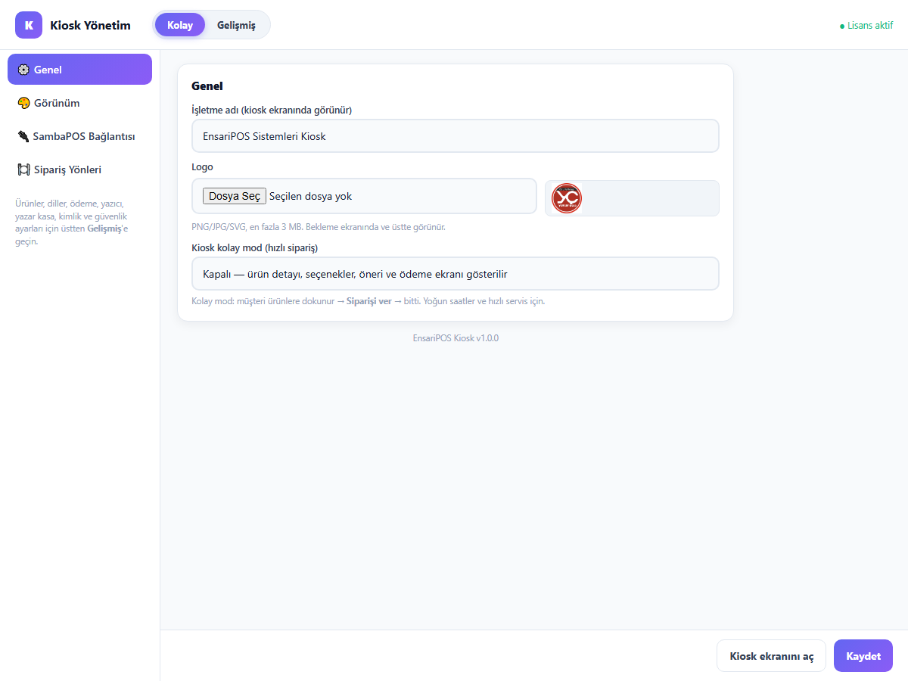

# EnsariPOS Kiosk — SambaPOS / AlfaPOS Self-Servis Sipariş Kioskı

SambaPOS / AlfaPOS self-servis sipariş kioskı (self-ordering kiosk): dokunmatik menü, ürün seçenekleri, çoklu dil, QR ile kart ödemesi (iyzico), fiş yazıcısı. C# Windows servisi.

> 🇬🇧 Self-service ordering kiosk for SambaPOS / AlfaPOS: touch menu, order tags, multi-language, QR card payment (iyzico), receipt printer.

> EnsariPOS ürünlerinden biridir · Tüm ürünler: https://github.com/yusuf631636/EnsariPOS

## Ekran görüntüleri

<p>
  
  
  
  
  
  
</p>

## Özellikler

- GoKiosk tarzı akış: karşılama → gel-al / masada → menü → sepet → ödeme → sipariş no
- Kategoriler ve fiyatlar SambaPOS menüsünden; kategori renkleri SambaPOS'tan
- Ürün seçenekleri (SambaPOS sipariş etiketleri) ve sipariş notu
- Ürün arama (ekran klavyesi), öne çıkanlar, "bunları da ister misiniz?" önerisi
- Masa seçimi: SambaPOS'taki gerçek masalar listelenir
- 6 dil (TR/EN/AR/DE/RU/FR), ürün adları otomatik çevrilir
- Ödeme: kasada öde, QR ile kart (iyzico), kart terminali altyapısı
- Kioskun kendi fiş yazıcısı (ESC/POS), adisyonda "Kiosk" notu
- Kolay mod, tema rengi, bekleme ekranı slider'ı, yazar kasa (ÖKC) ayar yeri
- Ayrı bulut "kiosk" lisansı

## Gereksinimler

- **Windows 10/11** veya Windows Server — SambaPOS'un kurulu olduğu bilgisayar ya da aynı ağdaki bir bilgisayar.
- **SambaPOS V5** veya **AlfaPOS** (SambaPOS tabanlı), SQL Server (Express) veritabanıyla.
- **SambaPOS Mesaj Sunucusu** açık ve erişilebilir (varsayılan port `9000`; Windows Güvenlik Duvarı'nda izinli).
- SambaPOS'ta **`EnsariGarson`** GraphQL istemci kaydı (ürünün kurulum paketi / hazırlık aracı otomatik ekler).
- SambaPOS'ta **Yönetici (Admin)** rolünde bir bağlantı kullanıcısı; kullanıcının **Şifre** alanı dolu olmalı (PIN değil).
- **C# sürümü** için: .NET Framework 4.7.2 veya üstü (Windows 10/11'de hazır gelir). Visual Studio gerekmez; derleme `csc.exe` ile yapılır.

## Kurulum paketi

Hazır kurulum paketi henüz yok; aşağıdaki adımlarla kaynak koddan çalıştırın.

## Kaynak koddan çalıştırma

```
git clone https://github.com/yusuf631636/EnsariPOS-Kiosk.git
cd EnsariPOS-Kiosk
```

**C# / .NET Framework 4.x** (`Kiosk-CSharp`) — Visual Studio gerekmez, Windows'un kendi derleyicisi (`csc.exe`) kullanılır:

```
cd Kiosk-CSharp
powershell -ExecutionPolicy Bypass -File derle.ps1      # KioskSrv.exe üretir (..\ortak\*.cs dahil)
copy config.example.json config.json
KioskSrv.exe /console                                 # servis olarak değil, konsolda çalıştırır
```

Kiosk ekranı: `http://localhost:8790/` · Yönetim paneli: `http://localhost:8790/admin` (ilk PIN `1234`, girince değiştirin). Tam ekran için `kiosk-baslat.bat`.

## Klasörler
| Klasör | İçerik |
|---|---|
| `Kiosk-CSharp` | KioskSrv servisi (kaynak/) + kiosk ekranı ve yönetim paneli (public/) |
| `ortak` | C# ürünlerinin paylaştığı kütüphane |

## Sık karşılaşılan sorunlar

**"Authorization is required … getUser"** — Bağlantı kullanıcısı SambaPOS'ta Yönetici rolünde değil. Kullanıcıyı Yönetici rolüne alın.

**"invalid_client" / "uygulama kaydı yok"** — SambaPOS'ta `EnsariGarson` istemci kaydı eksik. Ürünün hazırlık aracını SambaPOS bilgisayarında bir kez çalıştırın.

**"Bağlantı kullanıcısı adı/şifresi hatalı"** — SambaPOS kullanıcısının **Şifre** alanını yazın, PIN'i değil.

**"SambaPOS mesaj sunucusuna ulaşılamadı"** — SambaPOS ve Mesaj Sunucusu açık mı, port `9000` güvenlik duvarında açık mı, adres doğru mu kontrol edin.

**"Terminal kaydı alınamadı"** — Ayarlardaki departman / adisyon tipi / terminal adı SambaPOS'takiyle birebir aynı olmalı.

## Güvenlik

`config.json`, veritabanları, loglar, imza anahtarları ve müşteri verileri depoya eklenmez (`.gitignore`); örnek ayarlar `config.example.json` dosyalarındadır. Güvenlik açığı bildirimi: [SECURITY.md](SECURITY.md).

## Katkı

Katkılar Pull Request ile gelir ve proje sahibi onaylayınca birleştirilir — bkz. [CONTRIBUTING.md](CONTRIBUTING.md).

## Lisans

MIT — bkz. [LICENSE](LICENSE).
